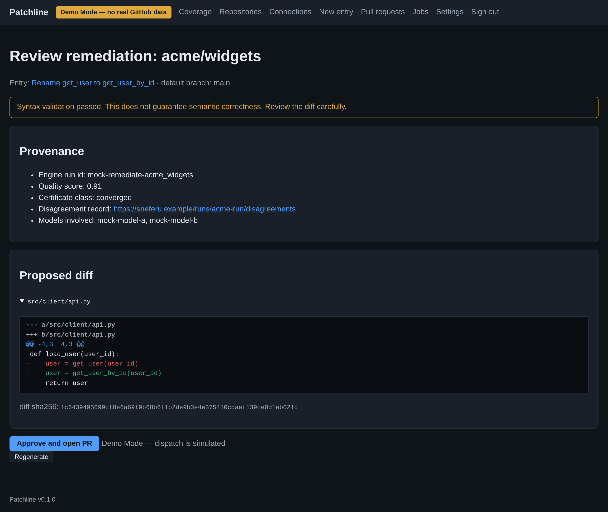
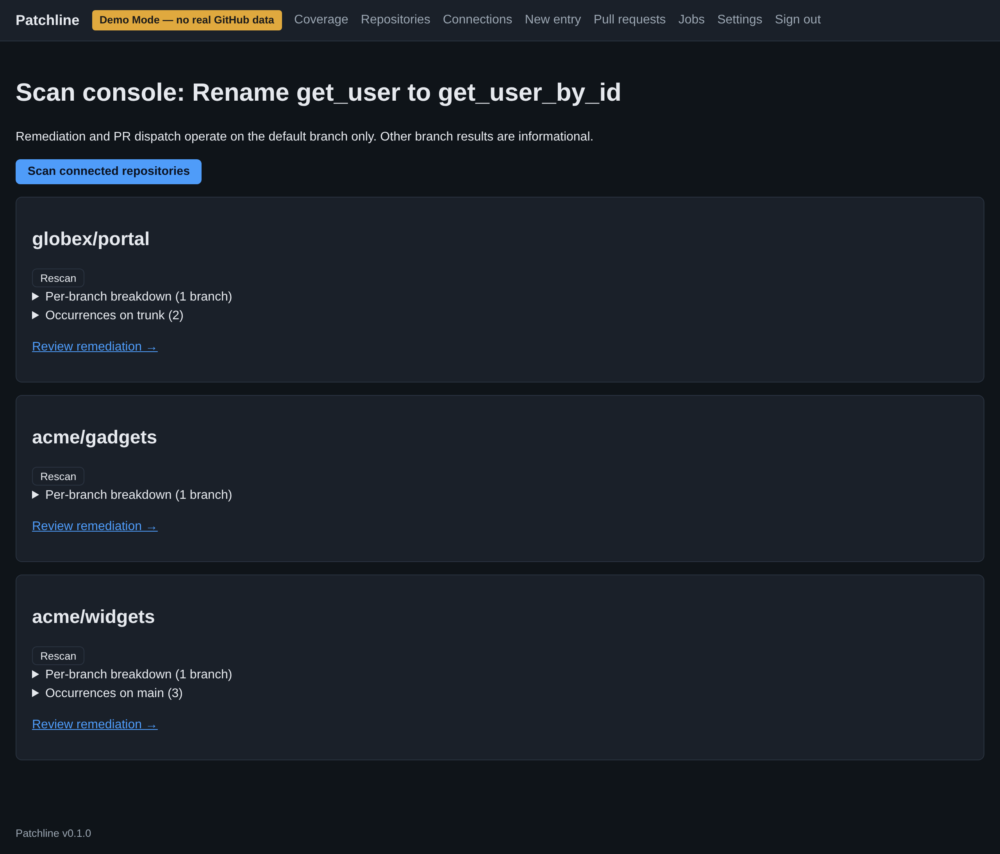
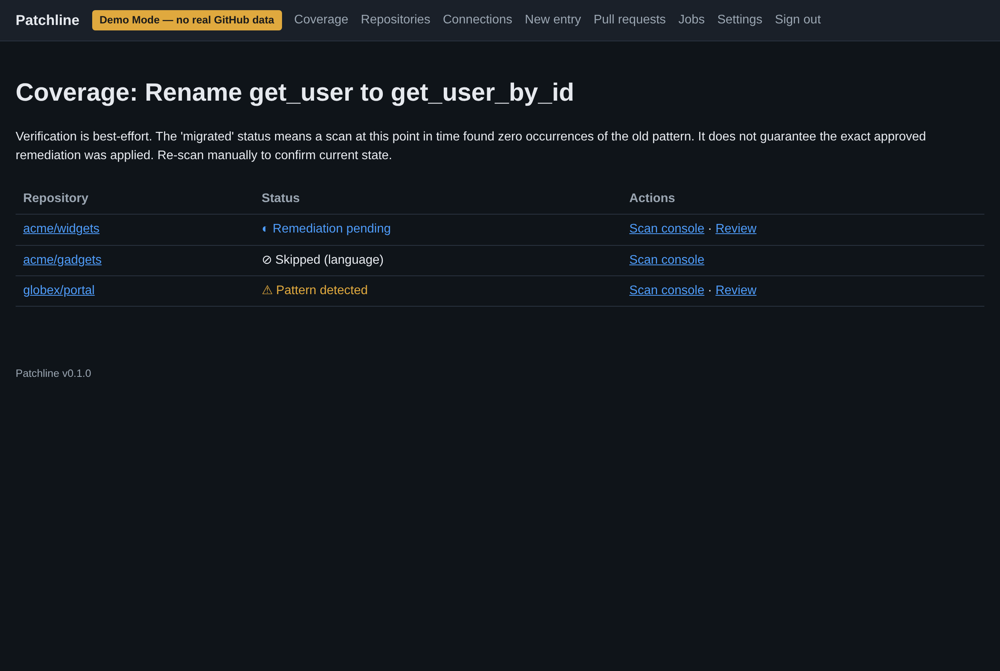

<div align="center">

# Patchline

**Your API changelog, turned into pull requests in your customers' code.**

An API vendor writes one change notice. Patchline finds the old call pattern in every connected customer repository, drafts the fix as a reviewable diff, and opens a PR once the vendor approves. Then it keeps a coverage board of who has migrated. **Merging is always a human act on GitHub. Patchline has no merge code path.**




</div>

---

## The flow

1. **Write the change once.** You describe what the API used to look like and what callers must do now, then pick a language.
2. **Scan everything.** One action queues a scan of every connected customer repository, one at a time and branch by branch. Repositories in another language are skipped with a stated reason.
3. **Review a real diff.** Each affected repository gets its remediation as a complete unified diff. The diff passes structural and syntax validation and is identified by its canonical SHA-256. It also carries its provenance: which engine run produced it, its quality score, whether the models converged, and a link to their disagreement record.
4. **Approve per repository.** Approval requires a fresh login and applies to one repository at a time. Only then does Patchline open a review-ready PR in the customer's repository, through the GitHub Git Data API. If a dispatch fails, the diff can be exported instead.
5. **Watch coverage.** A board tracks every change entry against every repository. After a PR is merged, a rescan checks the result, and a weekly job rescans everything to catch regressions.

<div align="center">

</div>

## What "migrated" means

*Migrated* means **a scan at this point in time found zero occurrences of the old pattern.** It does not mean the exact approved diff was applied: customers can edit a PR before they merge it. The coverage board and every PR body say so.

<div align="center">

</div>

## Try it without GitHub

Demo mode logs you in automatically. It uses fixture repositories for three demo customers (`acme/widgets`, `acme/gadgets`, `globex/portal`) and a mock engine, and it simulates dispatch. You don't need a GitHub App, OAuth or a live engine.

```bash
pip install -e .                                  # or: pip install poetry && poetry install
export DEMO_MODE=true SESSION_SECRET=$(openssl rand -hex 32) DATABASE_URL=sqlite:///./patchline.db
python -m patchline.cli migrate

uvicorn patchline.app:app --port 8000             # terminal 1: web
python -m patchline.worker                         # terminal 2: worker + rescan scheduler (required)
open http://localhost:8000/demo
```

This exact path was walked end to end in a real browser while preparing this repository:

1. create the entry
2. derive the patterns
3. scan all three repositories (3 + 2 occurrences, with one skipped for language)
4. generate the remediation
5. approve, which runs a simulated dispatch

For a real deployment, create a GitHub App and fill in [`.env.example`](.env.example); every variable is annotated. A `Dockerfile` and `docker-compose.yml` are included, but they weren't built here. The operator CLI covers `migrate`, `verify-config`, `revoke-sessions`, `export-pilot-evidence`, `cleanup` and fixture tools.

## Tests

```bash
pytest tests/        # 184 passed
```

The suite includes the full hermetic journey (entry → derivation → scan → remediation, with the diff hash checked independently → dispatch against a logged fake of the GitHub Git Data API → PR → verification scan → *migrated*). It also has a **structural test that no merge path exists**, plus coverage of webhook handlers, the job queue, diff hashing and application, and the auth rules.

## Built on Sneferu

Patchline is designed to run on a Sneferu engine over HTTP (`ENGINE_MODE=sneferu`). The model work is three engine workflows, and their names are configuration, not code:

| Step | Workflow (env) | Adapter call |
|---|---|---|
| Turn a changelog entry into search patterns | `ENGINE_WORKFLOW_DERIVE=derive_patterns` | `POST {SNEFERU_BASE_URL}/workflows/derive_patterns/run` |
| Find the affected code in a customer repository | `ENGINE_WORKFLOW_SCAN=scan_repository` | `POST …/workflows/scan_repository/run` |
| Write the remediation diff, with provenance | `ENGINE_WORKFLOW_REMEDIATE=generate_remediation` | `POST …/workflows/generate_remediation/run` |

Every remediation carries the engine's provenance: run, quality score, certificate class, disagreement record, models. The review screen shows it.

**Checked against a real Sneferu engine (2026-09-23).** Patchline's adapter was pointed at a Sneferu server built from its own source (checkout `07174496`). `POST /workflows/{name}/run` returned 404, and so did `/version`. Sneferu does run generated workflows, but it starts them through its public `POST /runs/start` (or the SDK's `start_run`). Those runs are asynchronous: you poll `get_run` for the result. Patchline expects one synchronous call per step. So real-engine mode needs two things: the three workflows built in Sneferu (its Workflow Design lane makes and approves them), and this adapter moved to `start_run` + `get_run`. Until then, demo mode's mock engine is the working path.

## Status, honestly

- **The mock engine is the working path.** Real-engine mode waits on the Sneferu work above. The engine "contract" fixture was synthetic even though it was labeled *recorded*, and it's now labeled honestly.
- **Fixed while preparing this repository:** the deep health check (`/healthz?deep=1`) counted any non-5xx answer from the engine as healthy. Against today's Sneferu that meant a 404 read as "healthy" while every engine call would fail. It now needs a 2xx, and a test covers the 404 case.
- One GitHub App per deployment and one vendor per deployment. Repository content only: nothing is read at runtime.
- The scan console shows a *Review remediation* link even for a repository that was skipped for its language. The coverage board correctly omits it there.

## How it was made

**Sneferu's business pipeline** built Patchline as run `2026-08-04T19-38-49Z-pipeline-3bd43d3b`, from an operator's seed about broken API communication ("Changelogs don't get read"). It worked the idea into the commercial case for vendor-side changelog propagation, then a build-ready product contract, then a cooperative build between independent coder and reviewer models. The honest-trust wording ("migrated" defined as an absence at scan time, validated syntax that is not guaranteed semantics, no merge path) came from the pipeline's own review rounds. `CHANGELOG.md` and `SECURITY.md` are its release notes and threat notes.

<div align="center">

---

**Built by [Sneferu](https://sneferu.ai)**

<sub>README by Claude (Anthropic). The screenshots show demo mode with fixture repositories and a mock engine.</sub>

</div>
